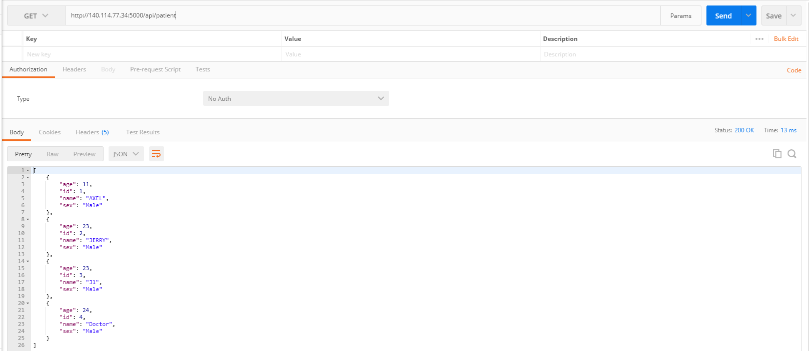
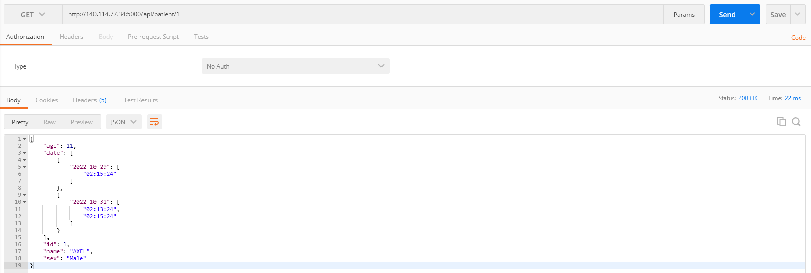
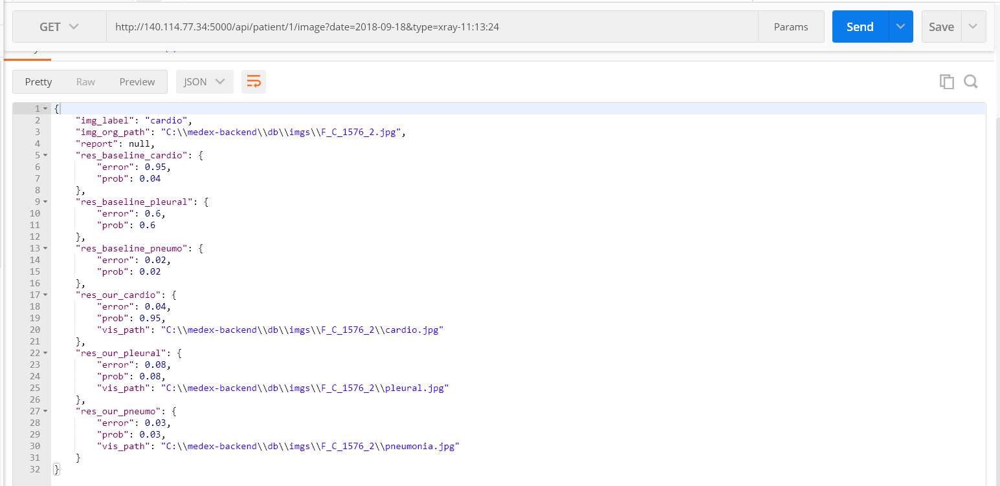
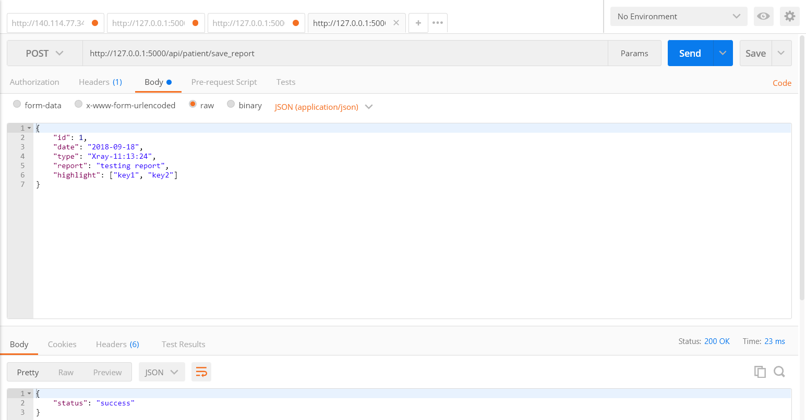

# API1

```
method: GET
route: /api/patient
response:
[
    {
        "age": int,
        "name": str,
        "id": int,
        "sex": int
    },
    {
        "age": int,
        "name": str,
        "id": int,
        "sex": int
    },
    ...
]
```



# API2

```
method: GET
route: /api/patient/<id>
request: id
response:
{
    "age": int,
    "date": {
        date:[time, time, ...],
        date:[time, time, ...],
        date:[time, time, ...]}
    "name": str,
    "id": int,
    "sex": int
}
```



# API3

```
method: GET
route: /api/patient/<id>/image
request: id, date, type
response:
{
    "highlight": [str, str, str],
    "img_label": str,
    "img_org_path": str,
    "pred_label": str/list
    "report": str,
    "res_our_cardio":{
        prob:float,
        path:str
    },
    "res_our_pneumo":{
        prob:float,
        path:str
    },
    "res_our_pleural":{
        prob:float,
        path:str
    },
    "res_baseline_cardio":{
        prob:float
    },
    "res_baseline_pneumo":{
        prob:float
    },
    "res_baseline_pleural":{
        prob:float
    },
}
```



# API4

```
method: POST
route: /api/patient/save_report
request:
{
    "id": int,
    "date": str,
    "type": str,
    "report": str,
    "highlight": [str, str, str]
}
response:
{
    "status":success/fail
}
```


