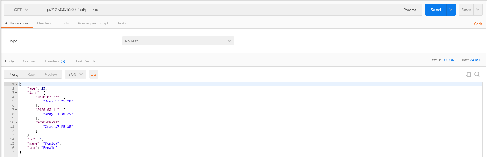

# API1

```
route: /api/patient
response:
[
    {
        "age": int,
        "name": str,
        "id": int,
        "sex": int
    },
    {
        "age": int,
        "name": str,
        "id": int,
        "sex": int
    },
    ...
]
```



# API2

```
route: /api/patient/<id>
request: id
response:
{
    "age": int,
    "date": [{date:[time, time, ...], date:[time, time, ...]}]
    "name": str,
    "id": int,
    "sex": int
}
```


# API3

```
route: /api/patient/<id>/images
request: id, date, type
response:
{
    "img_org_path":str,
    "img_vis_cardio_path":str,
    "img_vis_pneumonia_path":str,
    "img_vis_pleural_path":str
}
```

<!---->
